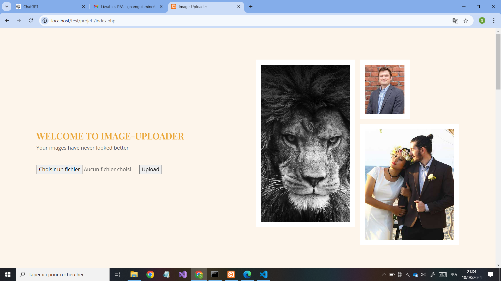
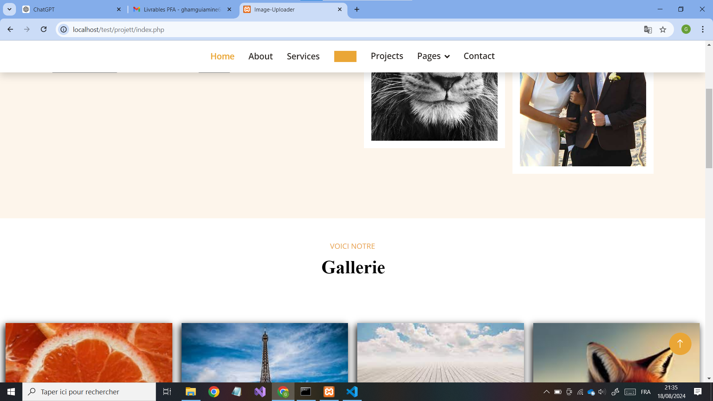
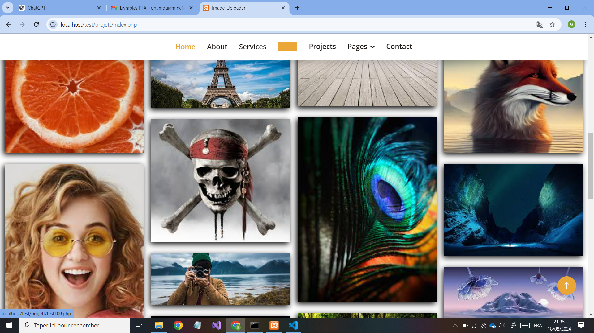
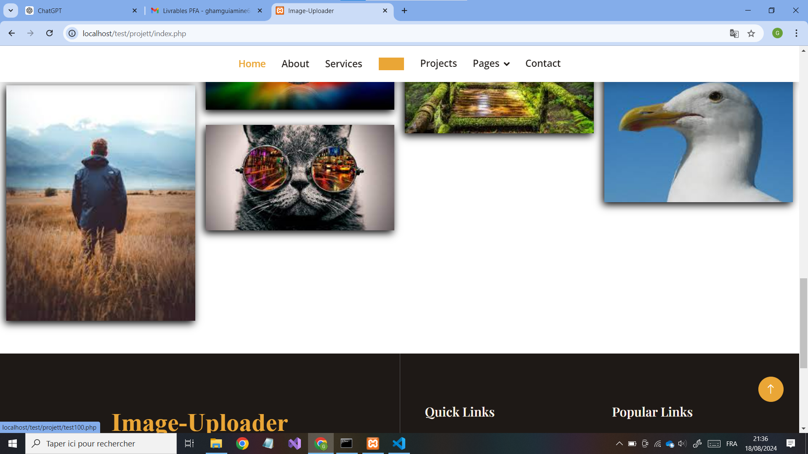
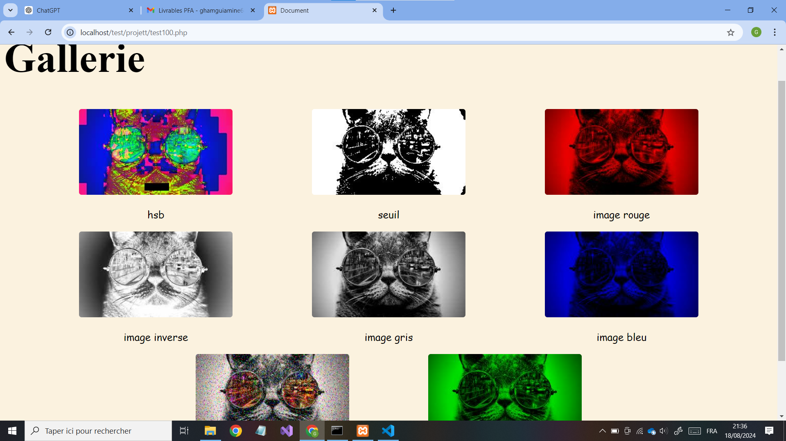
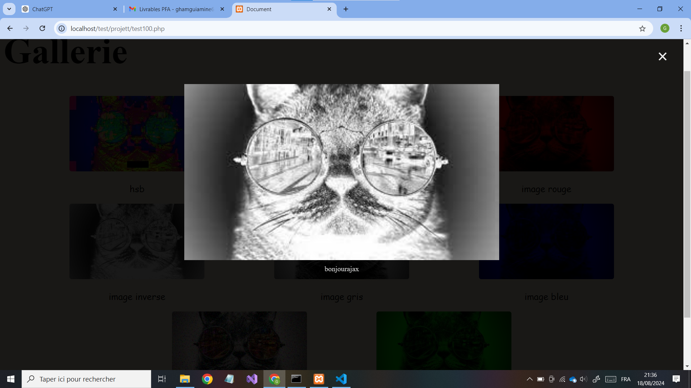

# Développement d'un Site Web pour le Filtrage d'Images

**Description :**

Ce projet consiste en le développement d'un site web dédié au filtrage d'images. Le backend du site est développé en utilisant Django, un framework web Python robuste et flexible. Le site utilise également PHP pour assurer la dynamisme du site et JavaScript (jQuery) pour les interactions.

**Technologies utilisées :**

- **Django** : Framework backend pour la gestion des requêtes et la logique de filtrage des images.
- **Python** : Langage de programmation principal pour le développement backend.
- **PHP** : Assure la dynamisme du site .
- **JavaScript (jQuery)** : Pour interactions dynamiques.

**Fonctionnalités principales :**

- **Filtrage d'Images** : Application des filtres sur les images téléchargées par les utilisateurs.
- **Téléchargement d'Images** : Interface permettant aux utilisateurs de télécharger des images à filtrer.
- **Interface Utilisateur** : Page web interactive permettant de visualiser les images filtrées et d'appliquer différents types de filtres.
- **Interaction Dynamique** : Utilisation de JavaScript et jQuery pour des interactions en temps réel et la gestion des événements utilisateur.
- **Dynamisme PHP** : PHP est utilisé pour ajouter des fonctionnalités dynamiques et gérer les aspects côté serveur du site.

**Instructions d'Installation et d'Utilisation :**

1. **Installer les Outils Requis :**
   - **XAMPP Control Panel** : Serveur local pour exécuter Apache et MySQL.
   - **Visual Studio Code** : Éditeur de code.
   - Installer les extensions **PHP** et **Django** dans Visual Studio Code.

2. **Configurer le Serveur Local :**
   - Ouvrir XAMPP et cliquer sur "Start" pour les modules **Apache** et **MySQL**.

3. **Télécharger l'Application Web :**
   - Placer le dossier de l'application web dans le répertoire `htdocs` de XAMPP.

4. **Configurer le Projet :**
   - Ouvrir le projet dans Visual Studio Code.
   - Dans le terminal de Visual Studio Code, naviguer vers le répertoire du projet Django avec la commande : `cd TestWebApi`.
   - Installer les bibliothèques manquantes en utilisant `pip`.

5. **Lancer le Serveur Django :**
   - Dans le terminal de Visual Studio Code, exécuter la commande : `python manage.py runserver`.

6. **Accéder à l'Application Web :**
   - Ouvrir un navigateur web et entrer l'URL suivante : `http://localhost/test/projett/test100.php`.

**demo**

1. **Téléchargement d'Images :**
   - Cliquez sur "Choisir un fichier" pour sélectionner une image à télécharger.
   - L'image téléchargée est ensuite enregistrée sur le site.

2. **Application de Filtres :**
   - Les filtres peuvent être appliqués aux images téléchargées.

3. **Visualisation des Images Filtrées :**
   - Lorsque vous cliquez sur une image, tous les filtres appliqués à cette image sont affichés.

---
Cette version est développée par Mohamed Amine Ghamgui.
